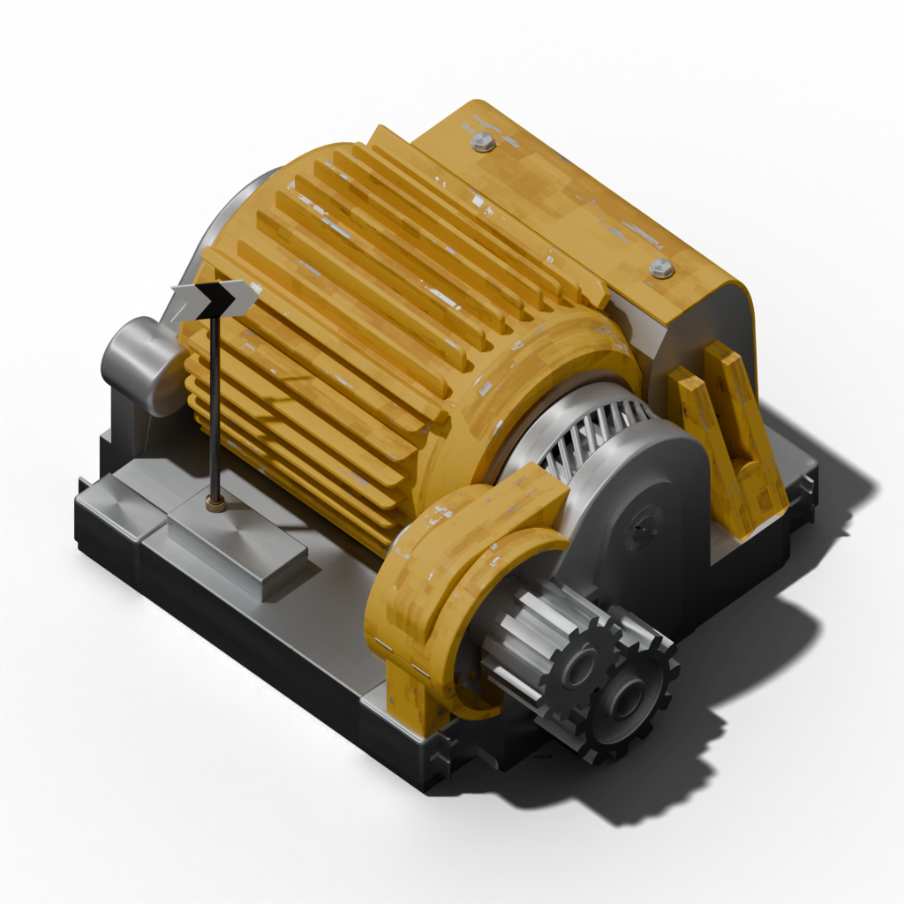
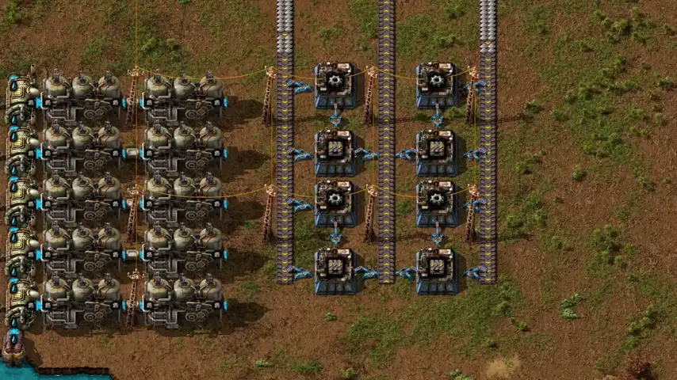
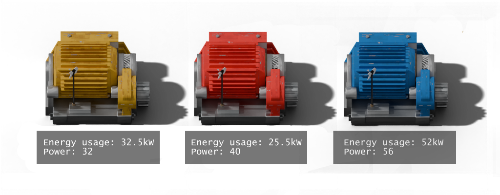
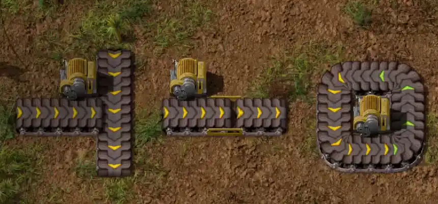
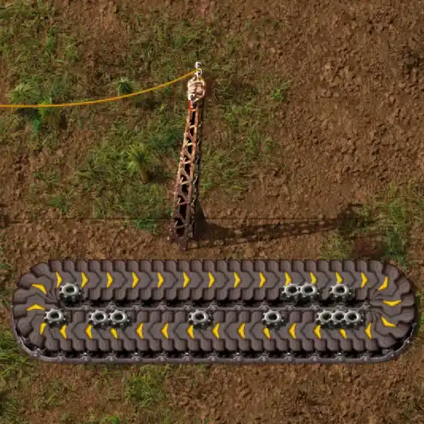
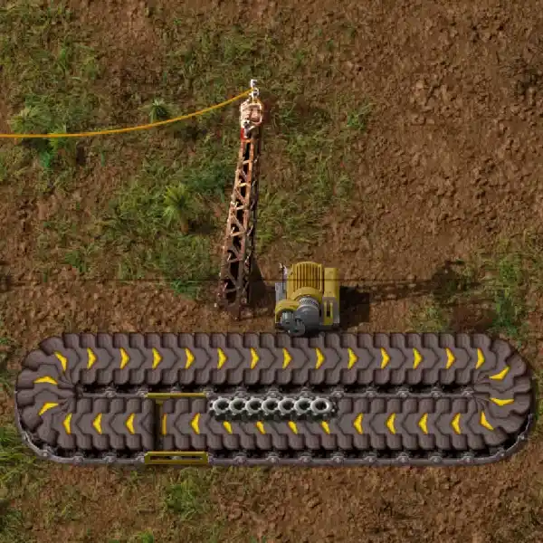

   

# Disaster Core Belts

Factorio 2.0 mod that introduces belt engines which consume energy to move connected belts

## Features

- Belt-like entities (belt, underground-belt, splitter) no longer move by themselves; to make them move, a **Belt Engine** must be connected to the side of the **belt-like entities section**
- Belts working state can't be controlled by circuit network (reading content of the belts by circuit network is available)
- New stat for belt-like entities **Drive resistance** - defines how much resistance one unit of belt-like entity adds to **belt-like entities section** that must be overcome by **Belt engine** to make section move
- New entity type **Belt engine** with stats **Energy usage** and **Power** are required to be placed near belt-like entities to make them move

   

- Circuit network can control working state of the **Belt engine** and with it the state of the connected **belt-like entities section**
- Mod introduces new term **belt-like entities section** - logically continuous connected collection of the belt-like entities of the same tier which must be powered by **belt engines** to move

   

- One **belt-like entities section** supports up to 3 **Belt engine**, each consecutive belt engine provides half of the power of the previous (if there are more than 3 engines, the top 3 by power are picked)

   

- Mod adds util entity type **section-divider** that allows split belt line to smaller sections

   

- Minor change in the starting technology tree: the logistics node now opens access to the first **Belt engine** (which depends on steam power and electronics), and the research unlock trigger was changed to crafting 10 transport belts

## Manual Installation

1. Download mod zip-file from [releases](https://github.com/Oxion/disastercore-belts/releases) section
2. Place zip-file to your Factorio mods directory:
   - Windows: `%APPDATA%\Factorio\mods\`
   - Linux: `~/.factorio/mods/`
   - Mac: `~/Library/Application Support/factorio/mods/`

3. Enable the mod in the Factorio mods menu

## Version

- Mod version: 1.0.1
